## FedSL: Federated Split Learning for Collaborative Healthcare Analytics on Resource-Constrained Wearable IoMT Devices

**Note:** All open-source code and simulation data are used for the following paper:

> **Title:** FedSL: Federated Split Learning for Collaborative Healthcare Analytics on Resource-Constrained Wearable IoMT Devices
>
> **Author:** Wanli Ni, Huiqing Ao, Hui Tian, Yonina C. Eldar, and Dusit Niyato

### 1. Split Learning

In Figure 1, we show the basic setting of split learning (SL). In this paradigm, an $N$-layer deep learning (DL) model is split into two sub-models by the cut layer: the device-side model and the server-side model. The output of the device-side model is called smashed data, which is some feature information extracted from the raw data. Since either the device or the server has only a partial model structure, the forward and backward propagation in each training round must traverse from device to server and from server to device, respectively.

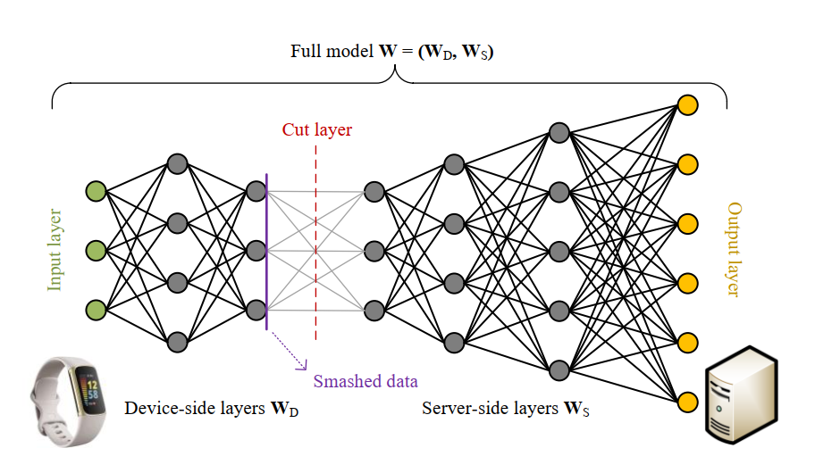

Figure 1. An illustration of the basic idea of SL using a single device and a server.

#### 1.1 Forward Propagation in SL

We denote the forward propagation functions at the device and server as $F_D(\cdot)$ and $F_S(\cdot)$, respectively. We denote the model weights at the device and server as $\mathbf{w}_D$ and $\mathbf{w}_S$, respectively. We denote the input data as $\{ \mathbf{x}, \mathbf{y} \}$, where $\mathbf{x}$ is the feature vector and $\mathbf{y}$ is the ground-truth label, Then, the smashed data output by the cut layer is given by
$$
\mathbf{c}_D = F_D (\mathbf{w}_D, \mathbf{x}).
$$
Next, the device sends the smashed data $\mathbf{s}_D$ and its corresponding  label $y$ to the server to complete the rest of the model training. Upon receiving the required data from the device, the serve proceeds to perform the forward propagation on the server-side model, which is given by
$$
\mathbf{c}_S = F_S (\mathbf{w}_S, \mathbf{c}_D).
$$
Till now, a round of forward propagation has been completed without sharing raw data on the device.

#### 1.2 Backward Propagation in SL

After the forward propagation, the server will back propagate the gradients from the output layer of the server-side model to the input layer of the device-side model to update the model weights $\mathbf{w}_D$ and $\mathbf{w}_S$. We denote the loss function as $L(\cdot)$. Then, the gradients of the server-side model is calculated by
$$
\mathbf{g}_S = \nabla_{\mathbf{w}_S} L (\mathbf{c}_S, \mathbf{y}).
$$
We denote the gradients at the first layer of the server-side model as $\mathbf{g}_S^1$. Then, the server sends $\mathbf{g}_S^1$​ back to the device to compute the rest of the backward propagation. Specifically, the  gradients of the device-side model is calculated by
$$
\mathbf{g}_D = \nabla_{\mathbf{w}_D} L (\mathbf{c}_S, \mathbf{y}).
$$
Using the gradient descent method to update the model weights at the server and the device, the update rule for $\mathbf{w}_D$ and $\mathbf{w}_S$ is, respectively, given by
$$
\mathbf{w}_S := \mathbf{w}_S - \eta \mathbf{g}_S, \\
\mathbf{w}_D := \mathbf{w}_D - \eta \mathbf{g}_D.
$$
During the training process of SL, the above forward and backward propagation will be iteratively executed multiple times until the DL model is well trained or the time is out.

### 2. Proposed FedSL Framework

In this work, we propose a federated split learning (FedSL) framework to achieve distributed machine learning on multiple resource-constrained devices, as shown in Figure 2. On the device side, each client is responsible for training a small shallow neural network. However, the edge server not only needs to undertake the computing task of the high-level subnetwork, but also needs to aggregate and synchronize these low-level sub-networks. 

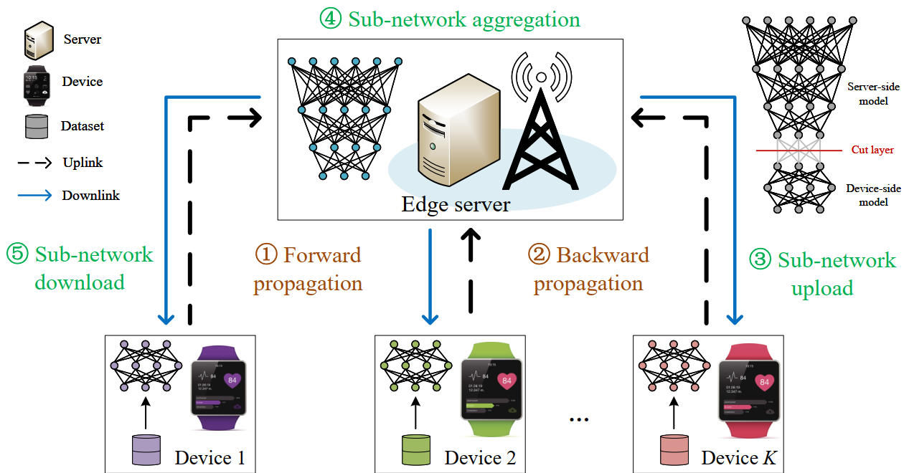

Figure 2. An illustration of the proposed FedSL framework.

In Figure 3, we illustrate the computation and communication processes of the proposed FedSL framework. Specifically, each training round of the proposed FedSL has two main stages: 1) multi-user split learning, and 2) federated sub-network averaging. In different stages, the data shared between devices and the server are different. In the first stage, devices share the ground-truth label and the smashed data with the server to complete the forward propagation. In addition, the server will transfer the gradients to local devices to complete the backward propagation. In the second stage, devices will share the sub-network parameters with the server to synchronize model parameters.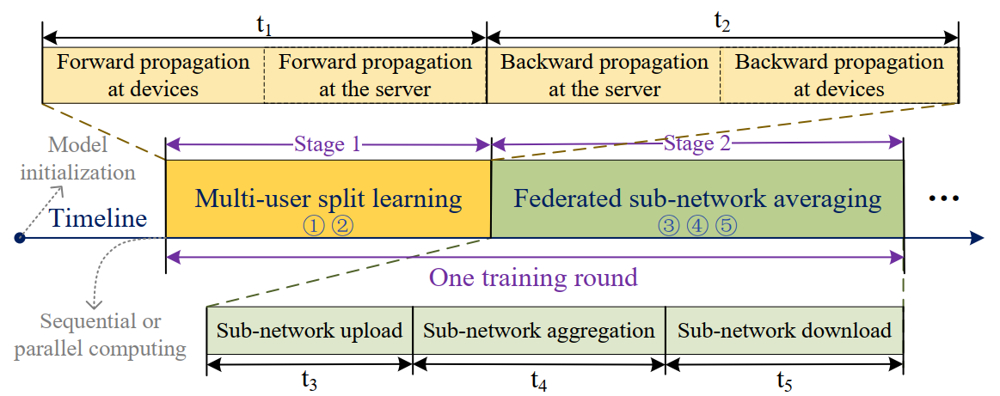

Figure 3. One training round of the proposed FedSL framework.

### 3. Experimental Results and Discussions

#### 3.1 Parameter Settings

| Parameters | Description                          | Value |
| ---------- | ------------------------------------ | ----- |
| Neural network | ResNet-18 | [64 64 64 64 64 128 128 128 128 256 256 256 256 512 512 512 512 2 or 4] |
| Dataset 1       | [Chest X-Ray](https://data.mendeley.com/datasets/rscbjbr9sj/3) | Two categories (PNEUMONIA: 4273, NORMAL: 1583) |
| Dataset 2       | [Optical Coherence Tomography (OCT)](https://data.mendeley.com/datasets/rscbjbr9sj/3) | Four categories (NORMAL: 51390, CNV: 37455, DME: 11598, DRUSEN: 8866) |
| Distribution 1  | Independent and identically distributed (IID) | Data distributions between devices are the same |
| Distribution 2  | Non-IID | Data distributions between devices are different |
| $K$      | Number of IoMT devices | 5     |
| $L_c$    | Index of the cut layer | 3     |
| $T$ | Maximum number of training rounds | 400 |
| $\eta$	| Learning rate    | 0.0001 |

#### 3.2 Comparison Schemes

| No.      | Name               | Description    |
| ------------ | ----------------------------- | ------------------ |
| `Scheme 1` | Centralized learning (CL)     | All data samples are sent to the server for model training      |
| `Scheme 2` | Federated learning (FL)       | Devices train their own models without sharing datasets|
| `Scheme 3` | Sequential FedSL | In one time slot, only a single device trains the model with the server using the split learning. |
| `Scheme 4` | Parallel FedSL | All devices train models simultaneously, and the server computes different models in parallel. |

#### 3.3 Simulation Results

Performance          |              Chest X-Ray images with the IID setting              | Chest X-Ray images with the non-IID setting 
:-------------------------:|:-------------------------:|:-------------------------:
Accuracy | 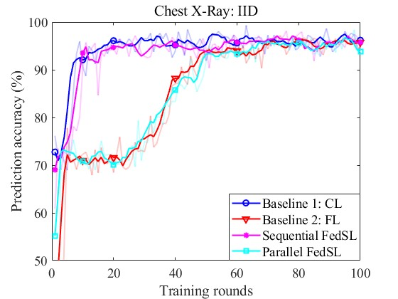  | 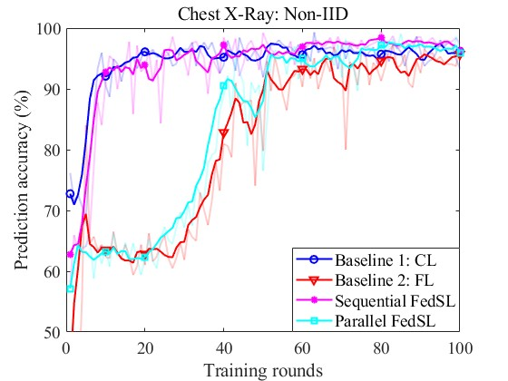 
Loss         | 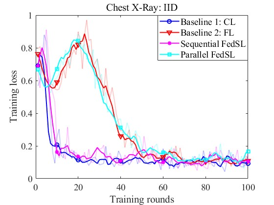  | 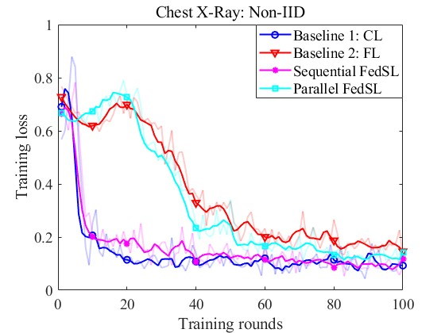 

Figure 4. Learning performance on the chest X-Ray dataset with IID and non-IID settings.

Performance          |              OCT images with the IID setting              | OCT images with the non-IID setting 
:-------------------------:|:-------------------------:|:-------------------------:
Accuracy | 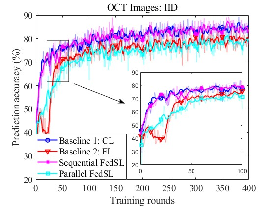  | 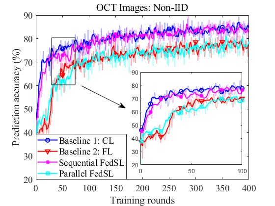 
Loss         | 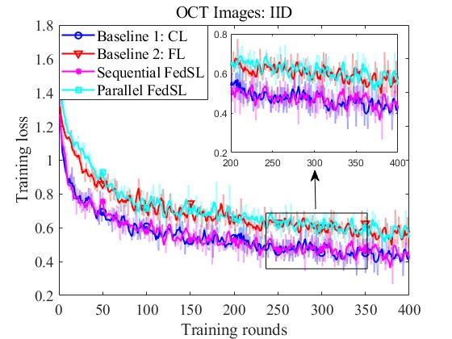  | 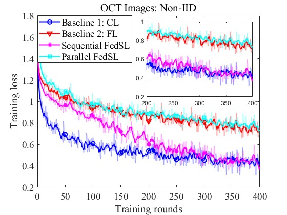 

Figure 5. Learning performance on the OCT dataset with IID and non-IID settings.

### 4. References

[1] A. Gatouillat, Y. Badr et al., “Internet of Medical Things: A review of recent contributions dealing with cyber-physical systems in medicine,” IEEE Internet of Things J., vol. 5, no. 5, pp. 3810–3822, Oct. 2018.

[2] P. Vepakomma, O. Gupta et al., “Split learning for health: Distributed deep learning without sharing raw patient data,” Dec. 2018. [Online]. Available: https://arxiv.org/pdf/1812.00564.pdf

[3] M. Zhang, L. Qu et al., “SplitAVG: A heterogeneity-aware federated deep learning method for medical imaging,” IEEE J. Biomed. Health Informatics, vol. 26, no. 9, pp. 4635–4644, Sept. 2022.

[4] D. S. Kermany, M. Goldbaum et al., “Identifying medical diagnoses and treatable diseases by image-based deep learning,” Cell, vol. 172, no. 5, pp. 1122–1131.e9, Feb. 2018.

[5] T. Gafni, N. Shlezinger et al., “Federated learning: A signal processing perspective,” IEEE Signal Process. Mag., vol. 39, no. 3, pp. 14–41, May 2022.

### 5. Directory Structure

```
code/
	├── Chest_XRay/
		├── pre_process_chest_xray_dataset.py
		├── IID/
			├── chest_xray_iid_data_processing.py
			├── CL_chest_xray_iid.py
			├── FL_chest_xray_iid.py
			├── SSL_chest_xray_iid.py
			└── FSL_chest_xray_iid.py
		└── Non-IID/
			├── chest_xray_non_iid_data_processing.py
			├── CL_chest_xray_non_iid.py
			├── FL_chest_xray_non_iid.py
			├── SSL_chest_xray_non_iid.py
			└── FSL_chest_xray_non_iid.py
	└── OCT/
		├── pre_process_OCT_dataset.py
		├── IID/
			├── OCT_iid_data_processing.py
			├── CL_OCT_iid.py
			├── FL_OCT_iid.py
			├── SSL_OCT_iid.py
			└── FSL_OCT_iid.py
		└── Non-IID/
			├── OCT_non_iid_data_processing.py
			├── CL_OCT_non_iid.py
			├── FL_OCT_non_iid.py
			├── SSL_OCT_non_iid.py
			└── FSL_OCT_non_iid.py
simulation_results/
	├── performance_on_the_chest_xray_dataset/
		├── draw_chest_xray_accuracy/
			├── draw_chest_xray_accuracy_iid.m
        		└── draw_chest_xray_accuracy_non_iid.m
		└── draw_chest_xray_loss/
			├── draw_chest_xray_loss_iid.m
			└── draw_chest_xray_loss_non_iid.m
	└── performance_on_the_OCT_dataset/
		├── draw_OCT_accuracy/
			├── draw_OCT_accuracy_iid.m
        		└── draw_OCT_accuracy_non_iid.m
		└── draw_OCT_loss/
			├── draw_OCT_loss_iid.m
			└── draw_OCT_loss_non_iid.m
```
